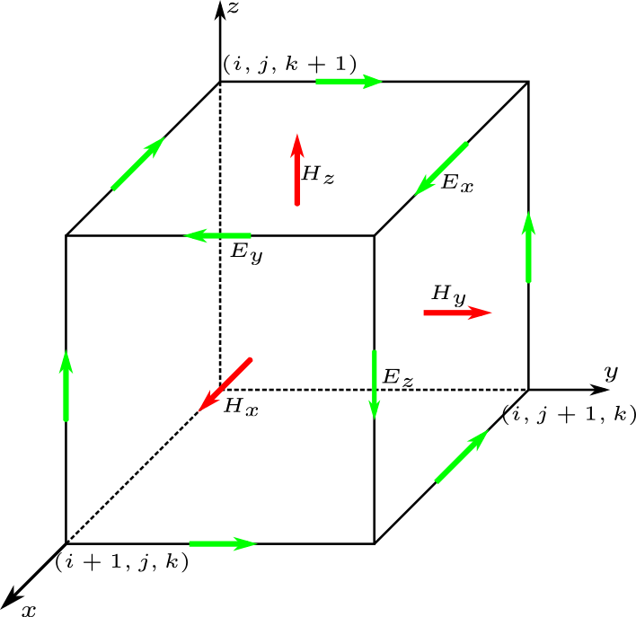
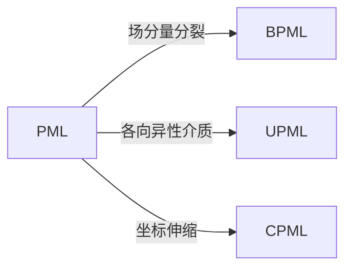
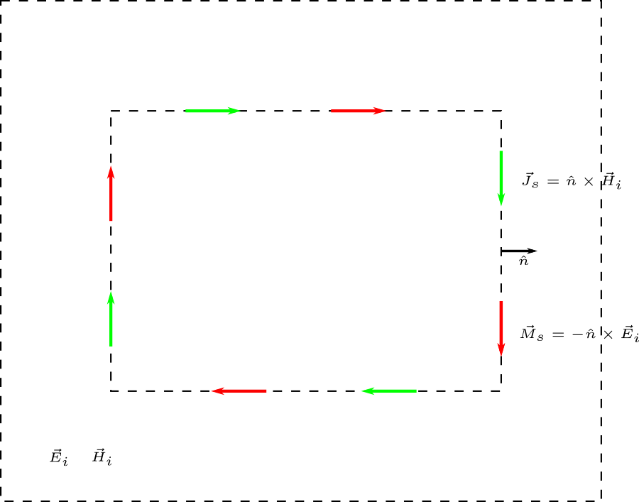
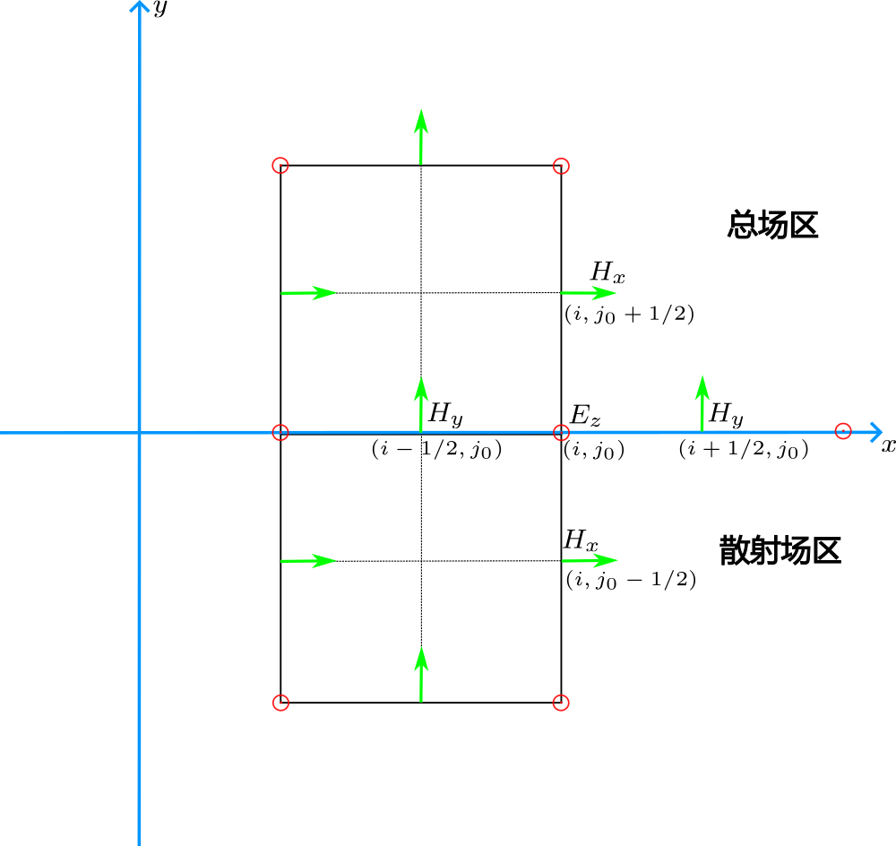
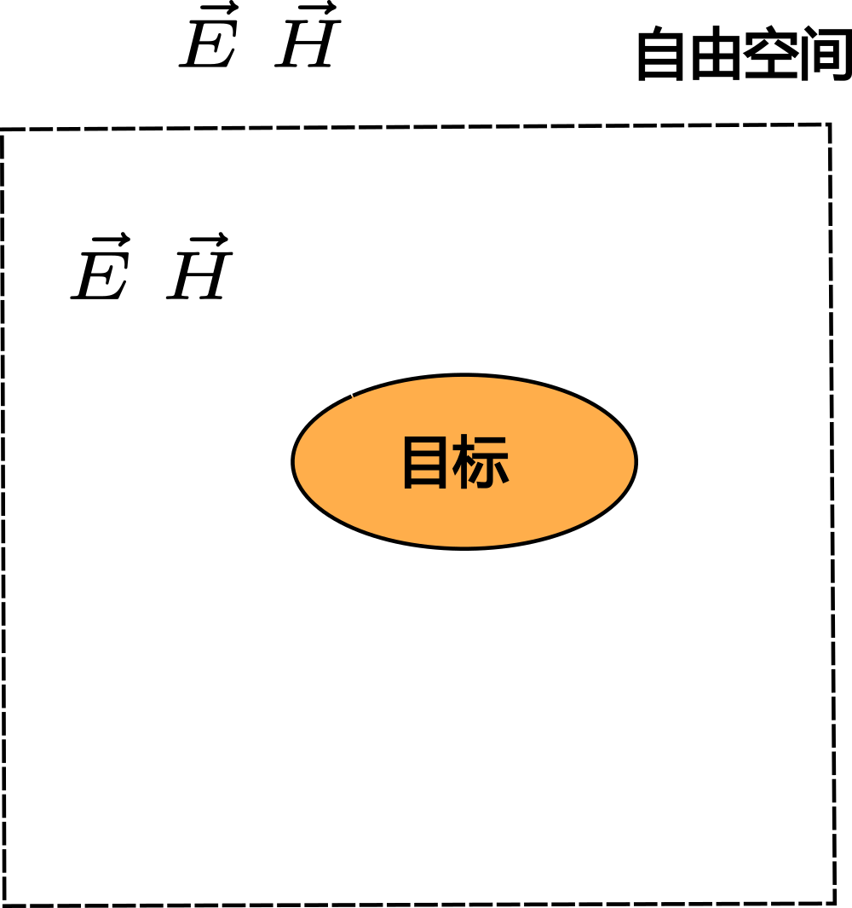
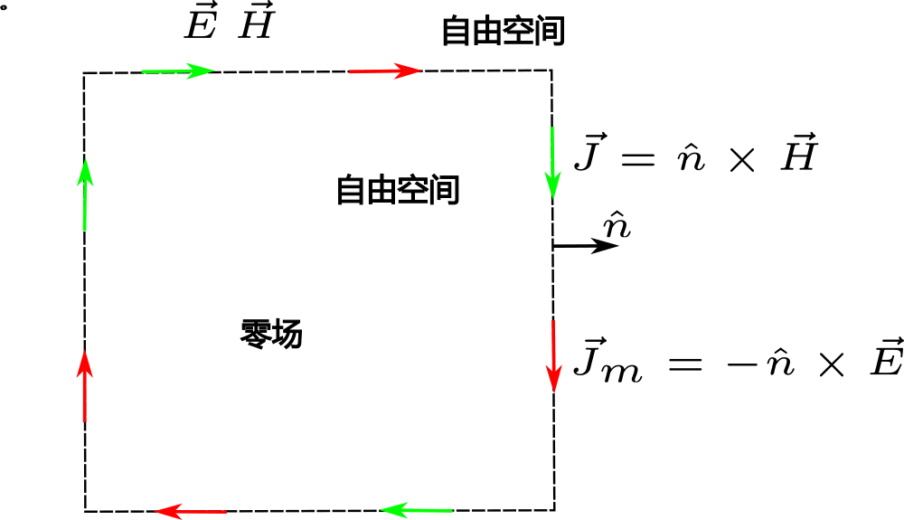
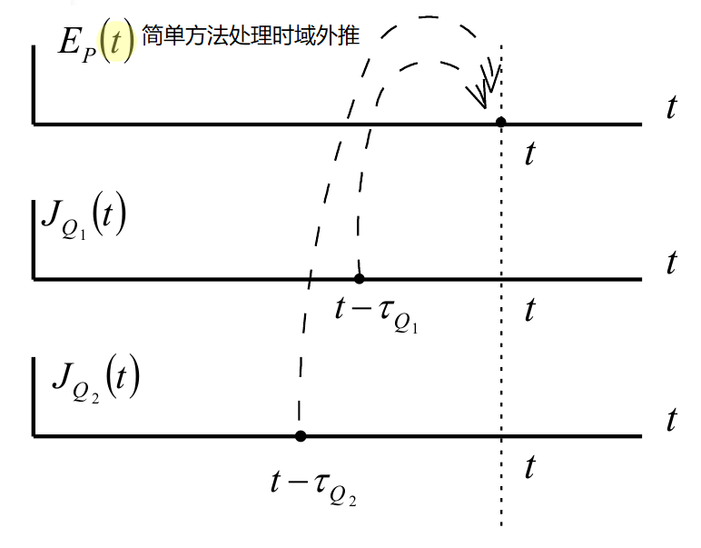
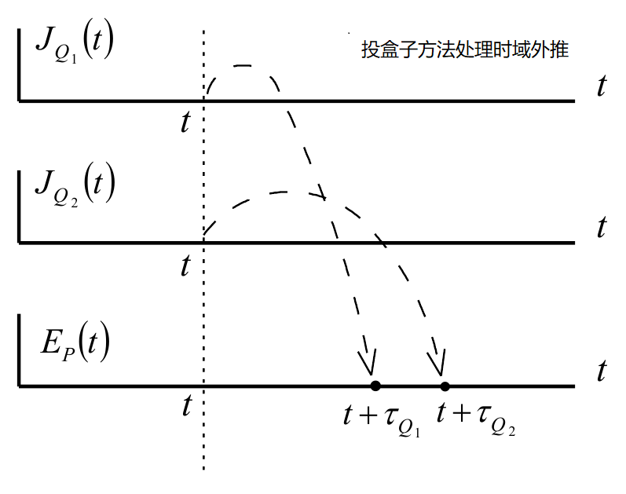
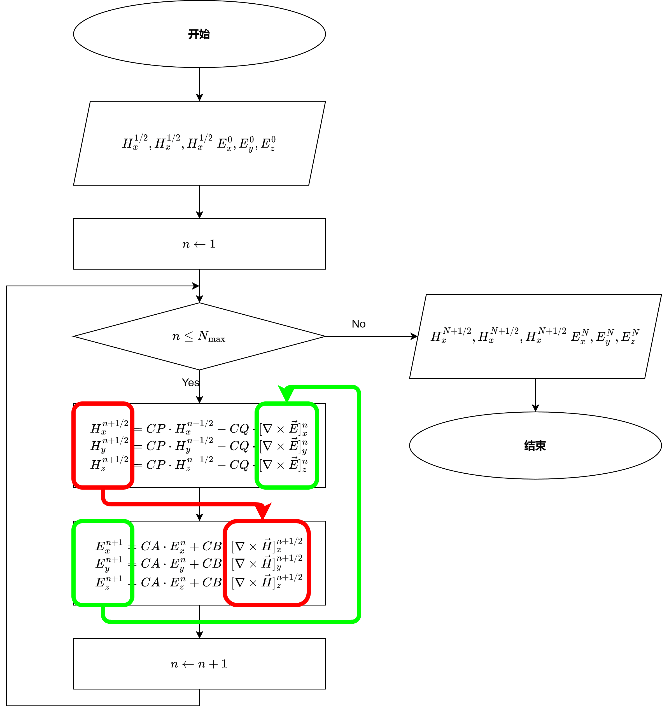

# 关于 FDTD

[TOC]

## 四个基本点

### Yee 元胞

    

* 每一个磁场分量由四个电场分量环绕；
* 每一个电场分量由四个磁场分量环绕；
* 电场和磁场在时间顺序上交替抽样，抽样时间彼此相差半个时间步。

**容易将 Maxwell 旋度方程（Faraday 电磁感应定律和 Ampere 环路定律）改写为显示差分方程。**

### 吸收边界

#### Mur 吸收边界

    

由数学上的 Engquist-Majda 吸收边界条件做近似得到 Mur 吸收边界条件

$$
\begin{aligned}
    f^{n+1}(P_0)=&f^n(Q_0)+\frac{c\Delta t-\delta}{c\Delta t+\delta}\left[f^{n+1}(Q_0)-f^n(P_0)\right]\\
    f^{n+1}(P_0)=&-f^{n-1}(Q_0)+\frac{c\Delta t-\delta}{c\Delta t+\delta}\left[f^{n+1}(Q_0)+f^{n-1}(P_0)\right]\\
    &-2\frac{c\Delta t-\delta}{\delta}\left[f^n(Q_0)+f^n(P_0)\right]\\
    &+\frac{(c\Delta)^2}{2\delta(c\Delta t+\delta)}\cdot[f^n(P_1)+f^n(P_2)+f^n(P_3)+f^n(P_4)\\
    &+f^n(Q_1)+f^n(Q_2)+f^n(Q_3)+f^n(Q_4)]
\end{aligned}
$$

#### PML

完全匹配层（Perfectly Matched Layer, PML）的设置

* 阻抗匹配，以实现无反射效果；
* 有耗介质，以实现透射波衰减。

### 散射场- 总场边界条件

#### 散射问题

    

**入射波只限制在总场区范围，在吸收边界的附近只有散射场，是外向行波，符合吸收边界上设置的吸收边界条件只能吸收外向行波的要求。**

#### 等效原理

    
    

在总场-散射场区的分界面上设置入射波电磁场的切向分量便可将入射波只引入到总场区。

#### 实际操作

    

* 计算 $H_y^{n+1/2}(i+1/2,j_0)$ 时涉及的 $E_z$ 节点均为总场，计算公式不变；
* 计算 $H_x^{n+1/2}(i,j_0-1/2)$ 属散射场，但计算涉及的两个 $E_z$ 节点分别为总场及散射场，应该在总场节点扣除入射波值；
* $E_z^{n+1}(i,j_0)$ 属于总场，计算时涉及的两个 $H_x$ 节点分别为总场及散射场，应该在散射场节点加上入射波值，另外两个 $H_y$ 节点均属总场。 

$$
\begin{aligned}
    H_y^{n+1/2}\left(i+\frac{1}{2},j_0\right)&=H_y^{n+1/2}\left(i+\frac{1}{2},j_0\right)_{\mathrm{FDTD}}\\
    H_x^{n+1/2}\left(i,j_0-\frac{1}{2}\right)&=H_x^{n+1/2}\left(i,j_0-\frac{1}{2}\right)_{\mathrm{FDTD}}+\frac{\Delta t}{\mu}\frac{E_{z,i}^n(i,j_0)}{\Delta y}\\
    E_z^{n+1}(i,j_0)&=E_z^{n+1}(i,j_0)_{\mathrm{FDTD}}+\frac{\Delta t}{\varepsilon}\frac{H_{x,i}^{n+1/2}\left(i,j_0-1/2\right)}{\Delta y}
\end{aligned}
$$

### 外推边界

#### 等效原理

    
    

计算远区的散射场等价于外推边界上的面电流 $\vec{J}$ 与面磁流 $\vec{J}_m$ 在自由空间的辐射问题。

$$
\begin{aligned}
    \vec{E}&=j\vec{k}\times\vec{F}-j\omega\mu\vec{A}-\frac{\vec{k}}{j\omega\varepsilon}(\vec{k}\cdot\vec{A})\\
    \vec{H}&=-j\vec{k}\times\vec{A}-j\omega\varepsilon\vec{F}-\frac{\vec{k}}{j\omega\mu}(\vec{k}\cdot\vec{F})\\
    &\vec{A}(\vec{r})=\int\vec{J}(\vec{r}')G(\vec{r},\vec{r}')\mathrm{d}v'\\
    &\vec{F}(\vec{r})=\int\vec{J}_m(\vec{r}')G(\vec{r},\vec{r}')\mathrm{d}v'
\end{aligned}
$$

可应用平均值方法或双界面方法处理面积分。

#### 时域外推

$$
\begin{aligned}
    e_\theta(t)&=-u_\varphi-Zw_\theta\\
    e_\varphi(t)&=u_\theta-Zw_\varphi\\
    \vec{w}(t)&=\frac{1}{4\pi rc}\frac{\partial}{\partial t}\int\vec{j}\left(\vec{r}',t+\frac{\hat{e}_r\cdot\vec{r}'}{c}-\frac{r}{c}\right)\mathrm{d}s'\\
    \vec{u}(t)&=\frac{1}{4\pi rc}\frac{\partial}{\partial t}\int\vec{j}_m\left(\vec{r}',t+\frac{\hat{e}_r\cdot\vec{r}'}{c}-\frac{r}{c}\right)\mathrm{d}s'
\end{aligned}
$$

可以用简单方法或投盒子方法处理面积分。

    
    

## 计算流程

    

