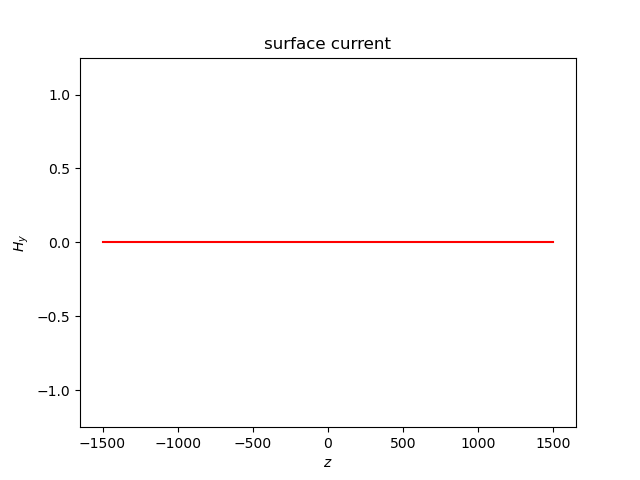

# 一维 FDTD 计算

[TOC]

假设一维 TEM 波沿 $z$ 轴传播，介质参数和场量与 $x$，$y$ 无关，即 $\partial/\partial x=0$，$\partial/\partial y=0$。那么，一维情形下的 Maxwell 方程组为

$$
\left\{\begin{aligned}
    -\frac{\partial H_y}{\partial z}&=\varepsilon\frac{\partial E_x}{\partial t}+\sigma E_x+J_x\\
    \frac{\partial E_x}{\partial z}&=-\mu\frac{\partial H_y}{\partial t}-\sigma_m H_y-J_{my}
\end{aligned}\right.
$$

其中，面电流源 $J_x$ 和面磁流源 $J_{my}$ 为外部激励。

## Yee 元胞离散

<center>
    
</center>

$E_x$，$H_y$ 在空间与时间的离散节点

| 电磁场分量 | 空间分量取样 | 时间取样 |
| :--: | :--: | :--: |
| $E_x$ | $k$ | $n$ | 
| $H_y$ | $k+1/2$ | $n+1/2$ |

那么，一维的 FDTD 离散为

$$
\begin{aligned}
    E_{x}^{n+1}(k)&=CA(m)\cdot E_x^n(k)-CB(m)\cdot\frac{H_y^{n+1/2}\left(k+\frac{1}{2}\right)-H_y^{n+1/2}\left(k-\frac{1}{2}\right)}{\Delta z}-\frac{CB(m)}{\Delta z}I_x^{n+1/2}(k)\\\\
    H_y^{n+1/2}\left(k+\frac{1}{2}\right)&=CP(m)\cdot H_{y}^{n-1/2}\left(k+\frac{1}{2}\right)-CQ(m)\cdot\frac{E_x^n(k+1)-E_x^n(k)}{\Delta z}-\frac{CQ(m)}{\Delta z}I_{my}^{n}(k)
\end{aligned}
$$

## 算例

<center class='half'>
    
    
</center>
<center>
    
</center>

```Fortran
do n = 1, 400
    forall (k = bound_l:bound_r, (k /= bound_l) .or. (k /= bound_r))
        E_x(k, n) = CA*E_x(k, n-1)-CB*(H_y(k, n-1)-H_y(k-1, n-1))/delta-CB/delta*j(k, n)    ! 电场迭代计算
        H_y(k, n) = CP*H_y(k, n-1)-CQ*(E_x(k+1, n)-E_x(k, n))/delta-CQ/delta*M(k,n)         ! 磁场迭代计算
    end forall
    ! 吸收边界
    ...
end do
```

*一开始写一维 FDTD 时，我用的是先计算电场，再计算磁场的方案，结果也还行。但是在编写二维 FDTD 计算程序时出现了问题。课本上的迭代公式基于先计算磁场再计算电场的方案*:smile:
